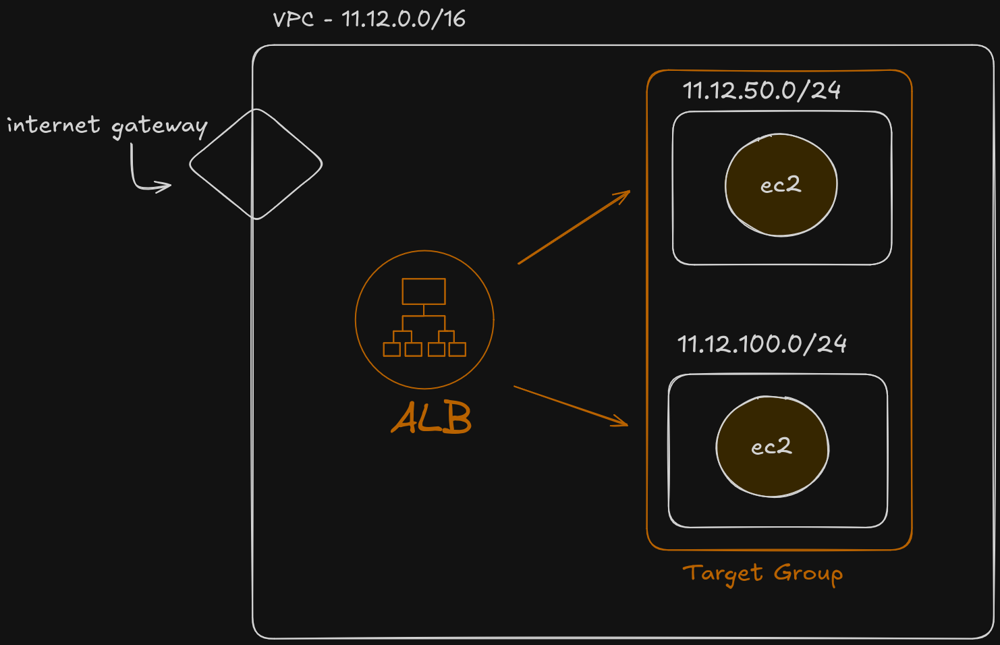

# AWS Load Balancer Setup Example with Terraform


## Requirements
- AWS account
- Terraform

# Setting up environment variables
The following environment variables must be set before running terraform code.  
```
export AWS_ACCESS_KEY_ID="anaccesskey"
export AWS_SECRET_ACCESS_KEY="asecretkey"
export AWS_REGION="us-west-2"  
```  
If you want to learn more about authenticating terraform with AWS, Read this  
https://registry.terraform.io/providers/hashicorp/aws/latest/docs#authentication-and-configuration

## How to run
Warning : Please review changes at 'terraform plan' stage.
```
terraform init
terraform plan
terraform apply
```
You can also undo the changes anytime by running
`
terraform destroy
`

## Architecture Diagram



